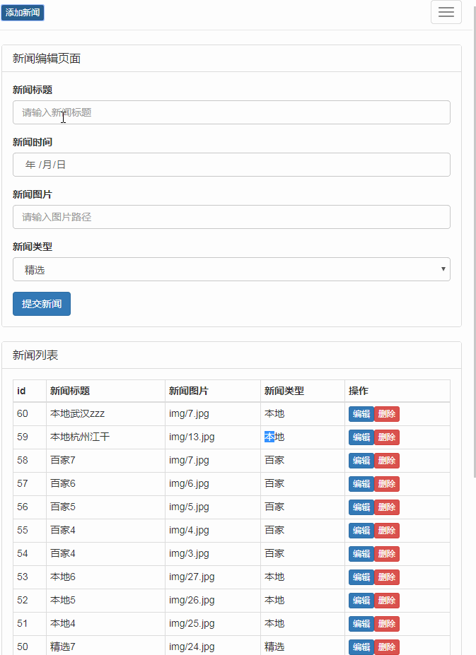

# zzz
zzz是一个基于nodejs的express框架开发的一个简单实现了前后台的demo

# Todo List
- [X] 浏览新闻
- [X] 新闻管理

目录结构

<pre>
zzz  WEB部署目录
├─bin                      存放启动文件
│  └─www                   服务器启动文件 
 
├─public                   公共文件夹
│  ├─css                   存放样式文件
│  ├─iconfont              存放字体文件
│  ├─img                   存放图片文件
│  ├─js                    存放js文件
│  │  ├─news.js            新闻管理的js文件
│  │  └─newsadmin.js       新闻显示的js文件
│  ├─admin.html            新闻管理页面      
│  └─app.html              新闻显示页面  
├─routes                   
│  ├─db.js                 数据库配置文件
│  ├─index.js              后台处理新闻展示程序
│  └─users.js              后台处理新闻管理程序 
├─view                     存放模板文件
├─node_modules             nodejs模块│
├─LICENSE.txt              授权说明文件
└─README.md                README 文件
</pre>

 新闻显示地址 http://127.0.0.1:3000/app.html
 新闻管理地址 http://127.0.0.1:3000/admin.html

<h2>作者长期从事程序开发</h2>
<pre>
<ul>
<li>昵称:datou</li>
<li>qq:2323178881</li>
<li>Tel:18329123270</li>
<li>微信:datou-leo</li>
<li>ci使用开发群:646864389</li>
</ul>
<pre>

# 界面预览

1.新闻展示
--

2.新闻管理

